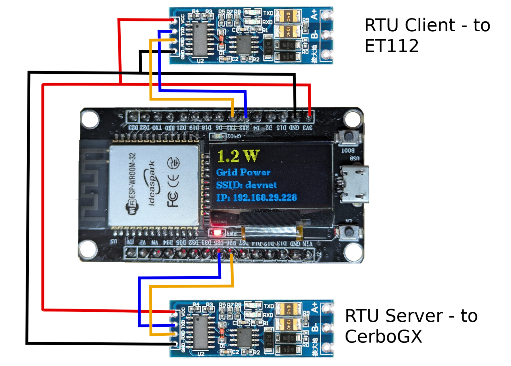
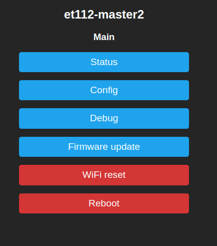
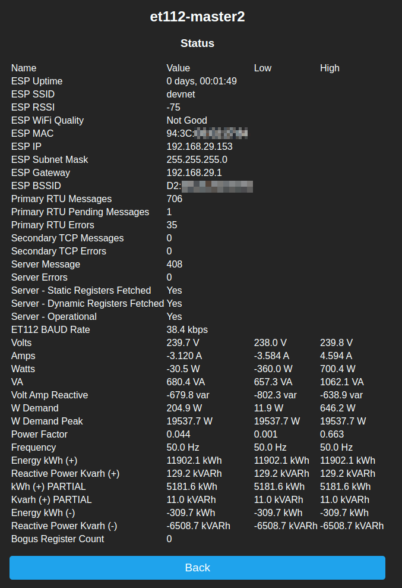
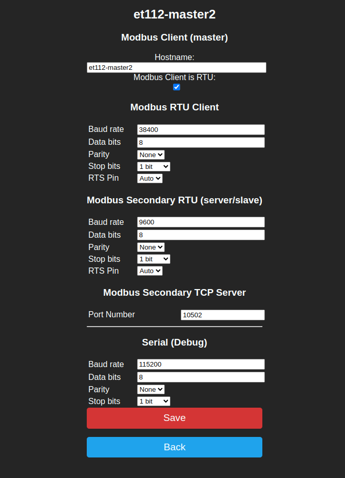
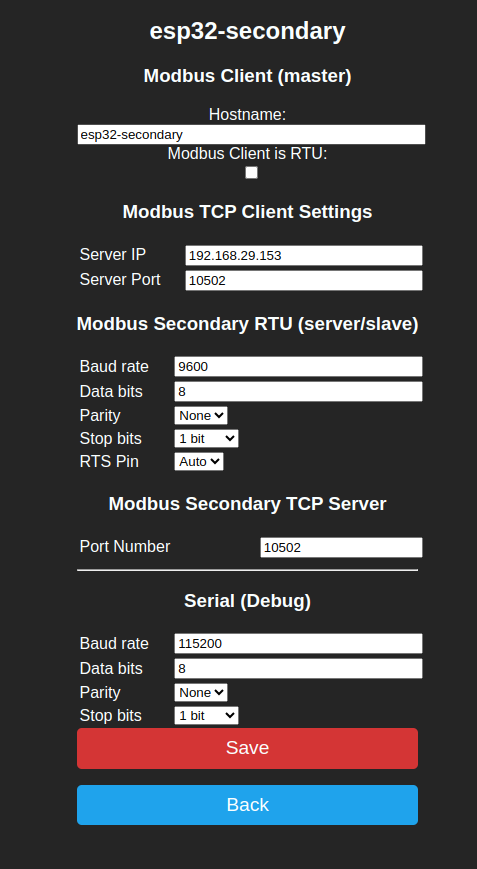

# ESP32 Modbus RTU/TCP Proxy/Gateway for Carlo Gavazzi (Victron) ET112 Energy Meter

This is a significant fork of the excellent Modbus RTU/TCP gateway by zivillian.

Unlike that project, this one is focused solely on the ET112 meter. This code provides a caching proxy server which you place
between the ET112 and the Victron CerboGX (or any other Modbus RTU client).

For its primary function it has three Modbus personalities at once:
1. It is a Modbus RTU Client that can speak to the ET112 (Modbus Server).
1. It is a Modbus TCP Server, offering access to the cached register values it has polled from the ET112.
1. It is a Modbus RTU Server, offering access to the cached register values it has polled from the ET112 (for CerboGX).

You can also use a second ESP32 with the exact same code to act as a Modbus RTU to Modbus TCP gateway. By this, I mean you can connect a second Modbus RTU client (e.g. a second CerboGX) to a second ESP32 acting as an RTU server. The cache in this second ESP32 unit is kept fresh by polling the primary unit.

If the cache goes stale (no data for a few seconds due to communication failure etc.), the device stops answering Modbus requests.

I have only focused on the CerboGX and the registers that it is interested in. Consequently a different device interested in
different registers, may not work. You can of course work out which registers it wants and edit the registers in main.cpp.

# Who needs this?

There are multiple reasons you might want this:

1. You have more than one device that wants to monitor an ET112, but you only have one ET112, and only one master is allowed on an RS485 network.
1. You would like an OLED display next to your ET112 to show you live data from the ET112.
1. You would like a web interface to view the key register values of the ET112
1. You would like to monitor the key register values with Prometheus
1. You would like to use ModbusTCP to monitor the mains usage from a system like Home Assisant.

# Can this be used to have two independent Victron Multiplus II ESS systems work together?

Not by itself, no. A pair of ESP32s with this code can indeed provide two CerboGX devices with live mains information. However, as the two systems do not know about one another, they will fight against each other when it comes to balancing the mains to a desired set-point. This can lead to one system being drained into the other.

It is only possible to achieve this by differentially manipulating the set-point of one of the two systems in order to reach the desired balance. I have done this separately as a Node Red project, which I am not ready to share.

# Hardware Notes

This has been built and tested for ESP32 devkit v1 with an optional 0.96" OLED display. I'm using it with the ideaspark® ESP32 Development Board with integrated 0.96 Inch OLED.

In addition to that you'll need a TTL to RS485 module for each Modbus RTU network.

A generic firmware for an ESP32 to be used as a Modbus TCP/IP gateway for any modbus RTU device.
Default RX/TX pins for the TTL-RS485 communication are used from hardware-serial2 (check pinout of your esp32-board for UART2-TX and UART2-RX).

## Powering the ESP32

You can use the 5V and GND in the RS485 USB cable from the CerboGX to power the ESP32, and the ESP32 in turn powers the TTL-RS485 modules.

# Software Notes

An unconfigured module will create its own Wi-fi Hotspot which you can use to get it joined to your Wi-fi network.

If the module fails to collect any data for 30 seconds, it will reboot.

# Extra functionality

## BAUD Rate

I have added a hidden page http://ipaddr/baudrate for changing the baud (bps) rate of the ET112. I found that there was less jitter and latency at a rate of 38.4kbps. I don't see any reason to exceed this, as past experience has shown that reliability declines as the bps rate climbs.

Use this feature at your own risk. I have read about people losing access (bricking) their ET112 when they set the rate too high. I have not seen this myself, but I'm not responsible for any unexpected consequences. You are.

## Prometheus

There is a /metrics URL, which can be scraped by Prometheus.

## SDM120 Emulation - DISABLED in platform.ini

There is code which was intended to create an RTU server which emulated an SDM120. This was never fully tested, and should not be expected to work witout some further effort.

## Hardware Setup

### ESP32 OLED 0.96" + 2 x XY-017 TTL-RS485 Board with automatic flow control

## Screenshots

### Home

### Status

### Primary Config

### Secondary Config

### Debug

